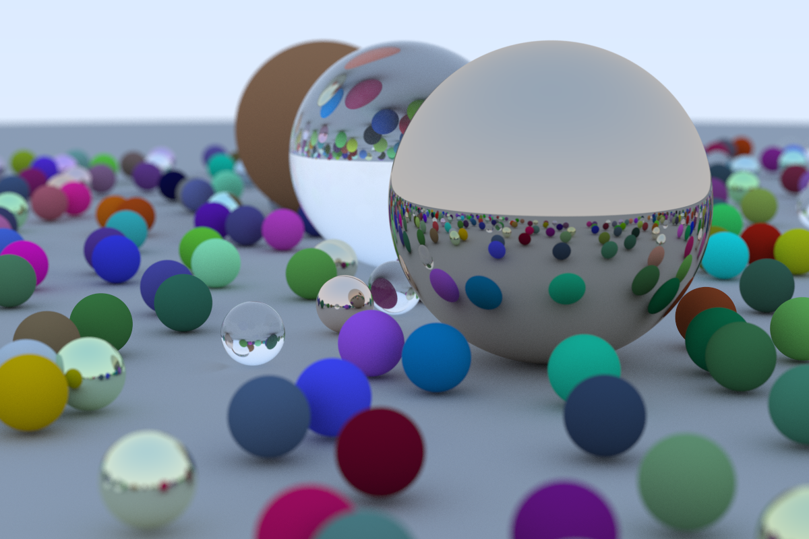

# ray-tracer

- [ray-tracer](#ray-tracer)
  - [Output an Image](#output-an-image)
    - [The PPM Image Format](#the-ppm-image-format)
    - [Generate a Sample Image](#generate-a-sample-image)
    - [Convert to Other Formats](#convert-to-other-formats)
  - [Draw a Background](#draw-a-background)
  - [Usage](#usage)
    - [Build](#build)
    - [Run](#run)
    - [Remove the Executable](#remove-the-executable)
  - [Progress](#progress)

A vanilla ray tracer implemented in C/C++.

Reference: [Ray Tracing in One Weekend](https://raytracing.github.io/books/RayTracingInOneWeekend.html)

## Output an Image

### The PPM Image Format

From [wikipedia](https://en.wikipedia.org/wiki/Netpbm#PPM_example):

```plain
P3
# "P3" means this is a RGB color image in ASCII
# "3 2" is the width and height of the image in pixels
# "255" is the maximum value for each color
# This, up through the "255" line below are the header.
# Everything after that is the image data: RGB triplets.
# In order: red, green, blue, yellow, white, and black.
3 2
255
255   0   0
  0 255   0
  0   0 255
255 255   0
255 255 255
  0   0   0
```

### Generate a Sample Image

```bash
g++ ppm_example.cpp -o ppm_example
./ppm_example > sample.ppm
```

The generated image (converted to PNG):


### Convert to Other Formats

Use `ffmpeg`:

```bash
ffmpeg -i input.ppm output.png
```

Or, use `ImageMagick`:

```bash
convert input.ppm output.png
```

## Draw a Background

```bash
g++ background.cpp -o bg_gen -std=c++11
./bg_gen > background.ppm
convert background.ppm background.png
```

The generated background:


## Usage

### Build

```bash
git clone https://github.com/Fyy10/ray-tracer.git
cd ray-tracer/
make
```

### Run

```bash
./main > pic.ppm
convert pic.ppm pic.png
```

The rendered image:



The code runs extremely slow (takes around 18 hours to produce a single 1200x800 image on my linux server with an Intel Core i3-530 CPU). GPU acceleration is important (not implemented yet).

### Remove the Executable

```bash
make clean
```

## Progress

- [x] 3D Vectors, 3D Points, Color
- [x] Rays, Basic Camera, and Background
- [x] Sphere Objects
  - [x] Surface Normal
  - [x] Hit Table and Multiple Objects
- [x] Antialiasing
- [x] Materials
  - [x] Diffuse Material
  - [x] Metal
  - [x] Dielectrics
- [x] Positionable Camera
- [x] Defocus Blur
- [x] Random Scene
- [ ] Parallel Acceleration for Rendering
